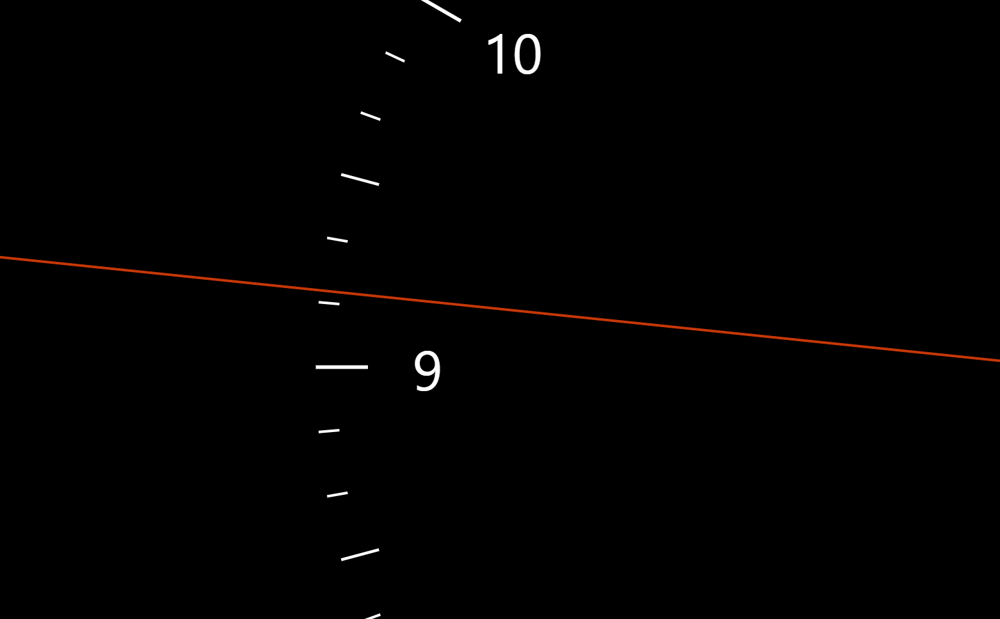

# Spotlight Canvas

This small library takes inspiration from the awesome Spotlight watch face ([link](https://github.com/willhou/spotlight)) and will turn any `<canvas>` element into an awesome clock

## Usage

First run `npm run build` to build all sorts of versions (esm, es6, umd)

Then use the following HTML body:

```html
<canvas id="canvas"></canvas>

<script src="dist/spotlight.js"></script>
<script>
  document.addEventListener("DOMContentLoaded", function () {
    var canvas = document.getElementById('canvas');
    var spotlight = new Spotlight.Spotlight(canvas);
  });
</script>
```

In the future I'll make this all easier, but for now this is the way to go about this. Hopefully we'll not need any other dependencies than typescript for this library.
